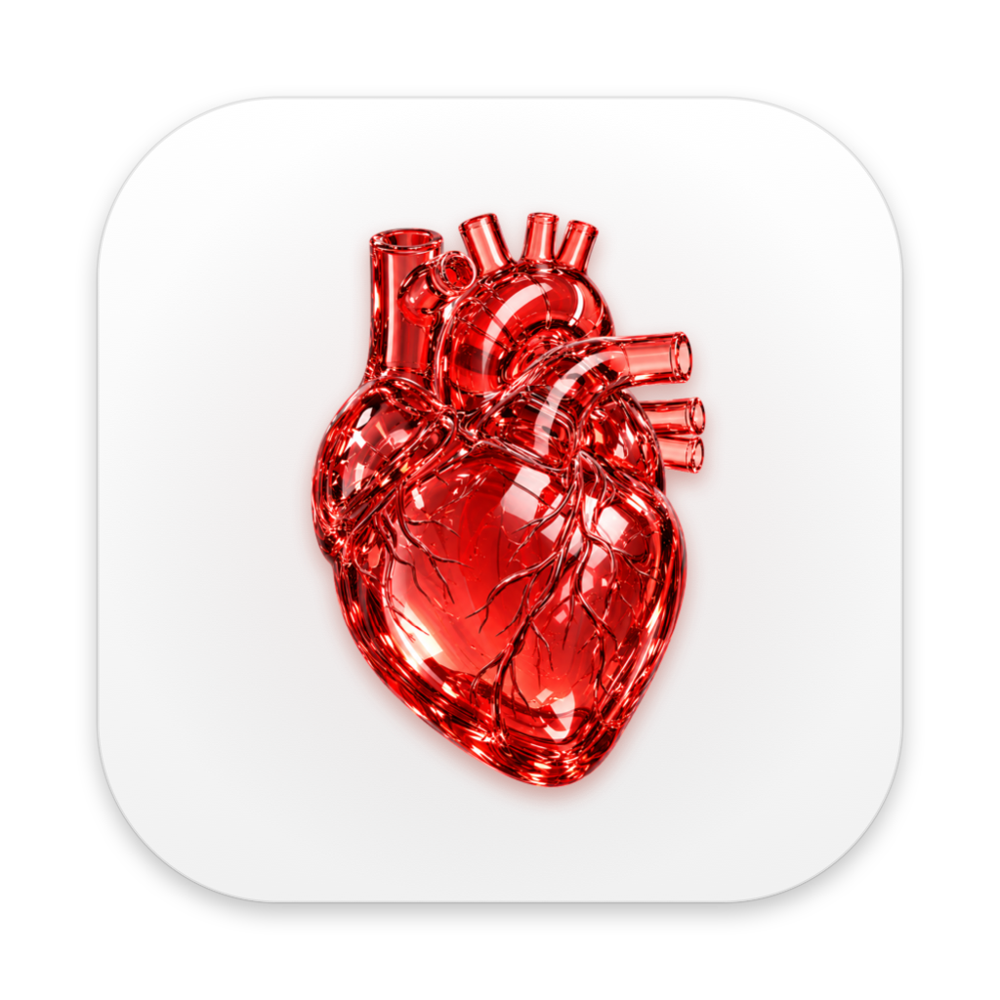
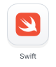
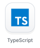
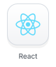
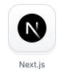
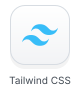
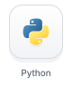
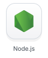
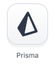
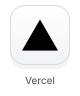

# Tomás Fernández Murga

**Web Engineer**

I build web products, native macOS apps and AI tools. Currently working on inclusive education at Zelmira and local commerce at CosiFind.

[LinkedIn](https://www.linkedin.com/in/tom%C3%A1s-fernandez-murga-9923a7247/) · [Portfolio](https://tomasfm.dev/)

 

## Selected Work

<table>
  <tr>
    <td width="76" align="center"></td>
    <td><strong><a href="https://github.com/tommyfm123/Parsec-Browser">Parsec</a></strong> Native macOS browser with WebKit, AI assistants and MCP integrations.</td>
  </tr>
  <tr>
    <td width="76" align="center"></td>
    <td><strong><a href="https://github.com/tommyfm123/Angio">Angio</a></strong> Native macOS viewer for DICOM angiography, IVUS and medical video.</td>
  </tr>
  <tr>
    <td width="76" align="center"></td>
    <td><strong><a href="https://zelmiralearning.com/">Zelmira</a></strong> AI tools that create and adapt educational materials for different learning needs.</td>
  </tr>
  <tr>
    <td width="76" align="center"></td>
    <td><strong>Orion</strong> On-device voice dictation for macOS, with local transcription and text editing.</td>
  </tr>
  <tr>
    <td width="76" align="center"></td>
    <td><strong><a href="https://cosifind.com/">CosiFind</a></strong> Find products in nearby stores, compare prices and contact sellers directly.</td>
  </tr>
</table>

 

## Tech Stack

  <picture>
    <source media="(prefers-color-scheme: dark)" srcset="assets/tech/dark/swift.svg">
    
  </picture>
  <picture>
    <source media="(prefers-color-scheme: dark)" srcset="assets/tech/dark/typescript.svg">
    
  </picture>
  <picture>
    <source media="(prefers-color-scheme: dark)" srcset="assets/tech/dark/react.svg">
    
  </picture>
  <picture>
    <source media="(prefers-color-scheme: dark)" srcset="assets/tech/dark/nextjs.svg">
    
  </picture>
  <picture>
    <source media="(prefers-color-scheme: dark)" srcset="assets/tech/dark/tailwindcss.svg">
    
  </picture>
  <picture>
    <source media="(prefers-color-scheme: dark)" srcset="assets/tech/dark/python.svg">
    
  </picture>

  <picture>
    <source media="(prefers-color-scheme: dark)" srcset="assets/tech/dark/nodejs.svg">
    
  </picture>
  <picture>
    <source media="(prefers-color-scheme: dark)" srcset="assets/tech/dark/postgresql.svg">
    
  </picture>
  <picture>
    <source media="(prefers-color-scheme: dark)" srcset="assets/tech/dark/prisma.svg">
    
  </picture>
  <picture>
    <source media="(prefers-color-scheme: dark)" srcset="assets/tech/dark/docker.svg">
    
  </picture>
  <picture>
    <source media="(prefers-color-scheme: dark)" srcset="assets/tech/dark/vercel.svg">
    
  </picture>
  <picture>
    <source media="(prefers-color-scheme: dark)" srcset="assets/tech/dark/git.svg">
    
  </picture>

