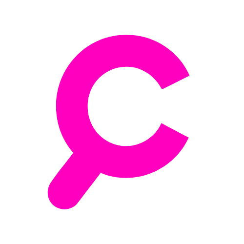
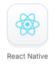
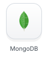
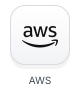
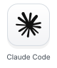
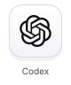
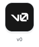
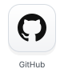
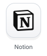
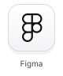

<h1 align="center">Tomás Fernández Murga</h1>

<h3 align="center">Web Engineer · AI Agents · Harness Engineering</h3>

  Web products, native macOS apps and AI agents. 
  Harness engineering, tool integration and AI workflows.

  <a href="https://www.linkedin.com/in/tom%C3%A1s-fernandez-murga-9923a7247/">
    <picture>
      <source media="(prefers-color-scheme: dark)" srcset="assets/links/dark/linkedin.svg">
      
    </picture>
  </a>
  <a href="https://tomasfm.dev/">
    <picture>
      <source media="(prefers-color-scheme: dark)" srcset="assets/links/dark/portfolio.svg">
      
    </picture>
  </a>

 

## Selected Work

<table>
  <tr>
    <td width="76" align="center"></td>
    <td><strong><a href="https://github.com/tommyfm123/Parsec-Browser">Parsec</a></strong> Native macOS browser with WebKit, AI assistants and MCP integrations.</td>
  </tr>
  <tr>
    <td width="76" align="center"></td>
    <td><strong><a href="https://github.com/tommyfm123/Angio">Angio</a></strong> Native macOS viewer for DICOM angiography, IVUS and medical video.</td>
  </tr>
  <tr>
    <td width="76" align="center"></td>
    <td><strong><a href="https://zelmiralearning.com/">Zelmira</a></strong> AI tools that create and adapt educational materials for different learning needs.</td>
  </tr>
  <tr>
    <td width="76" align="center"></td>
    <td><strong>Orion</strong> On-device voice dictation for macOS, with local transcription and text editing.</td>
  </tr>
  <tr>
    <td width="76" align="center"></td>
    <td><strong><a href="https://cosifind.com/">CosiFind</a></strong> Find products in nearby stores, compare prices and contact sellers directly.</td>
  </tr>
</table>

 

## Tech Stack

  <picture>
    <source media="(prefers-color-scheme: dark)" srcset="assets/tech/dark/swift.svg">
    
  </picture>
  <picture>
    <source media="(prefers-color-scheme: dark)" srcset="assets/tech/dark/typescript.svg">
    
  </picture>
  <picture>
    <source media="(prefers-color-scheme: dark)" srcset="assets/tech/dark/react.svg">
    
  </picture>
  <picture>
    <source media="(prefers-color-scheme: dark)" srcset="assets/tech/dark/reactnative.svg">
    
  </picture>
  <picture>
    <source media="(prefers-color-scheme: dark)" srcset="assets/tech/dark/nextjs.svg">
    
  </picture>
  <picture>
    <source media="(prefers-color-scheme: dark)" srcset="assets/tech/dark/tailwindcss.svg">
    
  </picture>

  <picture>
    <source media="(prefers-color-scheme: dark)" srcset="assets/tech/dark/nodejs.svg">
    
  </picture>
  <picture>
    <source media="(prefers-color-scheme: dark)" srcset="assets/tech/dark/python.svg">
    
  </picture>
  <picture>
    <source media="(prefers-color-scheme: dark)" srcset="assets/tech/dark/mongodb.svg">
    
  </picture>
  <picture>
    <source media="(prefers-color-scheme: dark)" srcset="assets/tech/dark/postgresql.svg">
    
  </picture>
  <picture>
    <source media="(prefers-color-scheme: dark)" srcset="assets/tech/dark/prisma.svg">
    
  </picture>
  <picture>
    <source media="(prefers-color-scheme: dark)" srcset="assets/tech/dark/docker.svg">
    
  </picture>

  <picture>
    <source media="(prefers-color-scheme: dark)" srcset="assets/tech/dark/aws.svg">
    
  </picture>
  <picture>
    <source media="(prefers-color-scheme: dark)" srcset="assets/tech/dark/vercel.svg">
    
  </picture>
  <picture>
    <source media="(prefers-color-scheme: dark)" srcset="assets/tech/dark/git.svg">
    
  </picture>

## AI & Tools

  <picture>
    <source media="(prefers-color-scheme: dark)" srcset="assets/tools/dark/cursor.svg">
    
  </picture>
  <picture>
    <source media="(prefers-color-scheme: dark)" srcset="assets/tools/dark/claude.svg">
    
  </picture>
  <picture>
    <source media="(prefers-color-scheme: dark)" srcset="assets/tools/dark/codex.svg">
    
  </picture>
  <picture>
    <source media="(prefers-color-scheme: dark)" srcset="assets/tools/dark/gemini.svg">
    
  </picture>
  <picture>
    <source media="(prefers-color-scheme: dark)" srcset="assets/tools/dark/v0.svg">
    
  </picture>
  <picture>
    <source media="(prefers-color-scheme: dark)" srcset="assets/tools/dark/github.svg">
    
  </picture>
  <picture>
    <source media="(prefers-color-scheme: dark)" srcset="assets/tools/dark/notion.svg">
    
  </picture>
  <picture>
    <source media="(prefers-color-scheme: dark)" srcset="assets/tools/dark/figma.svg">
    
  </picture>

